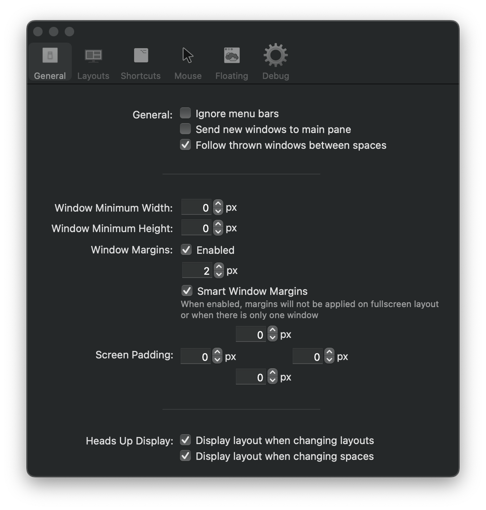
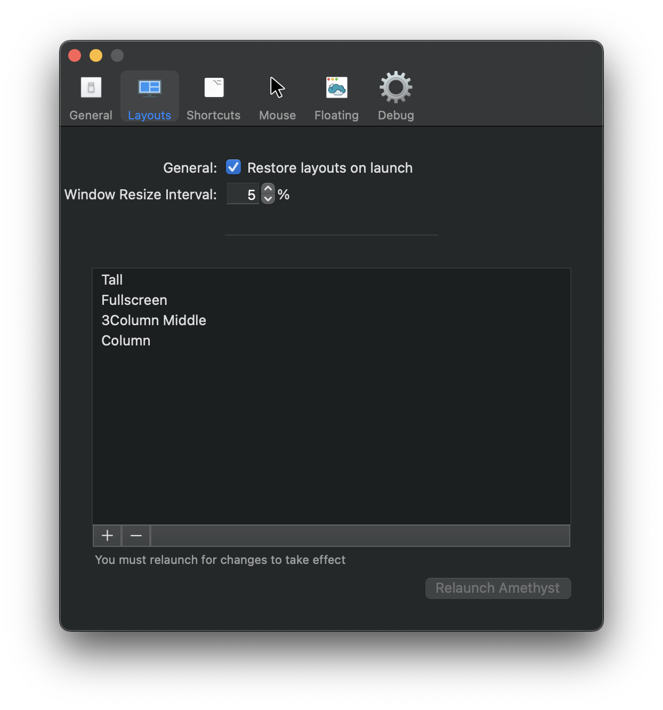
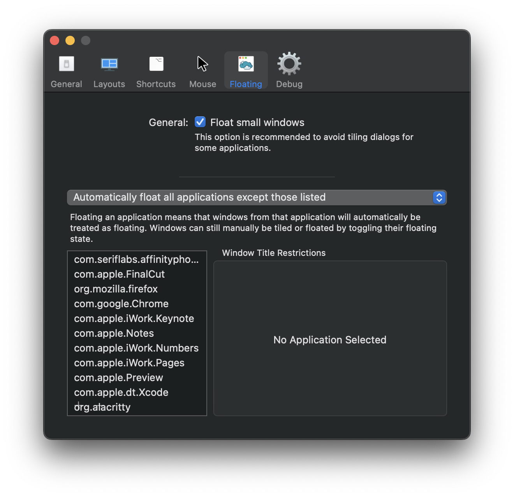

# Amethyst Configuration for an i3-like Experience

### General

### Layouts

### Shortcuts
All other key shortcuts can be undefined except for the following:

| Function | Key Binding |
| ----- | ----- |
| Cycle layout forward | `Alt-.` |
| Cycle layout backwards | `Alt-,` |
| Move focus counter clockwise | `Alt-j` |
| Move focus clockwise | `Alt-k` |
| Swap focused window counter clockwise | `Alt-Shift-j` |
| Swap focused window clockwise | `Alt-Shift-k` |
| Force window to be reevaluated | Default |
| Throw focused window to space N | `Alt-Shift-N` |
| Toggle float for focused window | `Alt-Shift-Space` |
| Toggle focus follows mouse | Default |
| Relaunch Amethyst | Default |

### Floating

Example set of windows to be tiled by default:
 * Affinity Photo
 * Final Cut Pro
 * DaVinci Resolve
 * Firefox
 * Chrome
 * Keynote
 * Notes
 * Numbers
 * Pages
 * Preview
 * Xcode
 * Alacritty
 * Neovide
