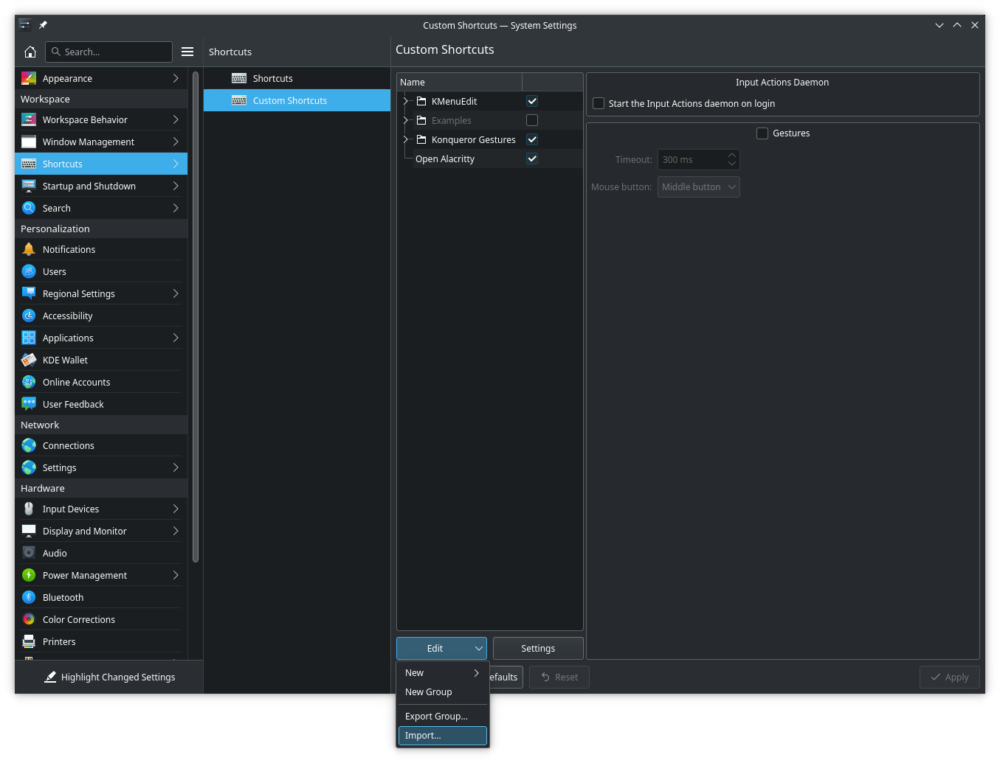

# KDE Bismuth setup for an i3-like experience
### Enabling Bismuth
Within KDE Settings, go to **Window Management** :arrow_right: **Window Tiling** :arrow_right: **Behavior** and check _Enable window tiling_. Make sure to customize the options as one pleases but the included screenshot contains sensible defaults coming from i3: 

#### Customized Layouts
Selected layouts are left as an exercise for the configurator but sensible defaults include the following:
* Tile Layout
* Monocle Layout
* Three Column Layout
* Quarter Layout

#### Window Rules
Window rules are also left as an exercise for the configurator. Sensible suggestions are to ensure the following window classes are added to **Float Windows**:
* systemsettings
* plasma-discover
* dolphin

### Setting up keyboard shortcuts

#### KWin and tiling

Select `kde-i3-like.kksrc` to import.

#### Global open terminal
Assuming the preferred terminal is `alacritty`, select `kde-i3-like.khotkeys` to import.

