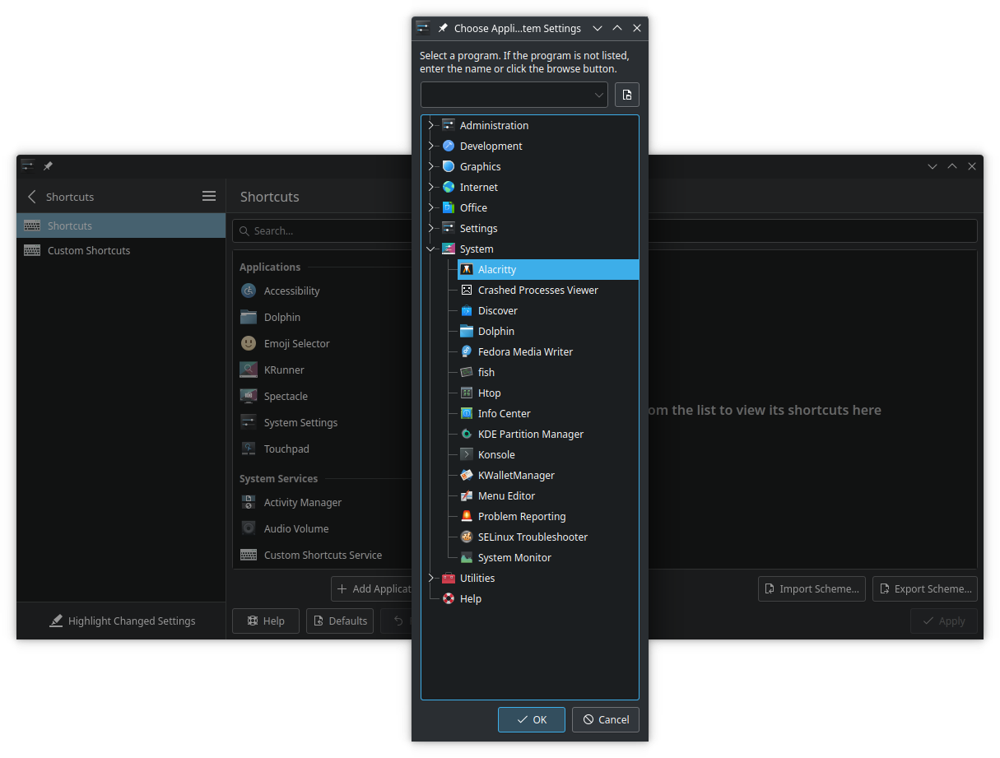
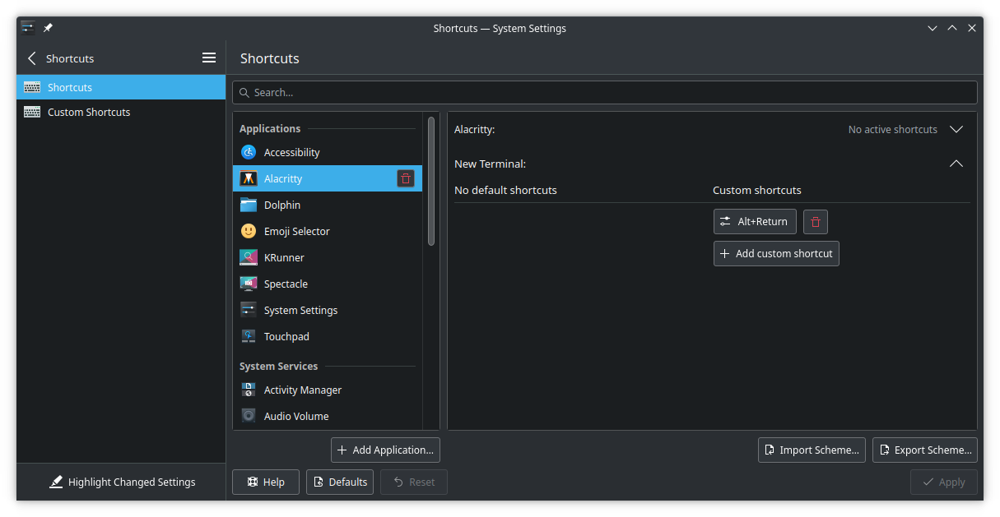

# KDE Bismuth setup for an i3-like experience
### Enabling Bismuth
Within KDE Settings, go to **Window Management** :arrow_right: **Window Tiling** :arrow_right: **Behavior** and check _Enable window tiling_. Make sure to customize the options as one pleases but the included screenshot contains sensible defaults coming from i3: 

#### Customized Layouts
Selected layouts are left as an exercise for the configurator but sensible defaults include the following:
* Tile Layout
* Monocle Layout
* Three Column Layout
* Quarter Layout

#### Window Rules
Window rules are also left as an exercise for the configurator. Sensible suggestions are to ensure the following window classes are added to **Float Windows**:
<pre>
systemsettings,plasma-discover,dolphin
</pre>

#### Appearance
Tiling appearance is an exercise left to the reader but for uniformity, the following settings are used:

### Setting up keyboard shortcuts
Previously, **Custom Shortcuts** was used to define a global shortcut for opening a terminal. However, this settings option does not exist on KDE Wayland. To mitigate, we set up an Alacritty New Terminal shortcut that works just as well.

First, add Alacritty as an application shortcut.

Set preferred shortcut, `Alt-Enter`, to spawn a new terminal.

